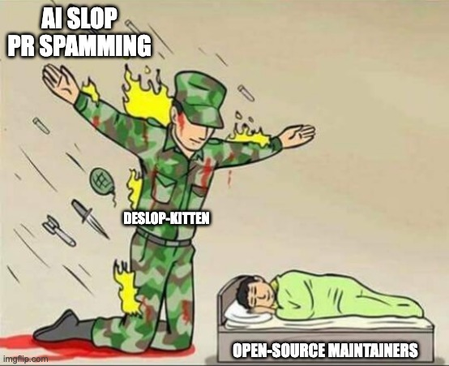
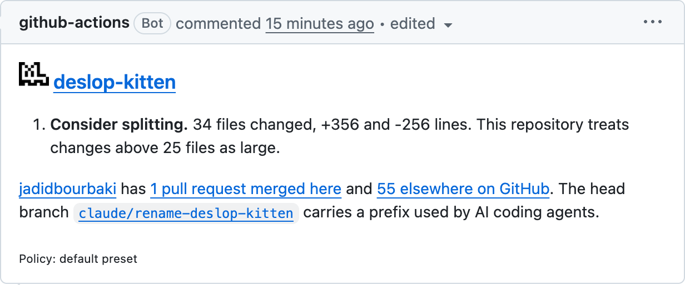

<p align="center">
  
</p>

<p align="center">A GitHub Action that checks each pull request against your contribution policy and costs nothing to run.</p>

<p align="center">
  <a href="https://github.com/dorcha-inc/deslop-kitten/actions/workflows/ci.yml"></a>
  <a href="LICENSE"></a>
</p>

deslop-kitten reads each incoming pull request, compares it with the
contribution policy your repository has written down, and leaves one
comment: what to do before review, and who sent the change. Everything
runs inside the Actions job. A 0.8B open model on the runner's CPU
answers the one question that needs a language model, so deslop-kitten
calls no proprietary LLM, needs no API key, and sends you no bill. It
never blocks a merge.

## Motivation

<p align="center">
  
</p>

Writing a pull request now takes minutes and reviewing one still takes
an afternoon. Agents opened an estimated seventeen million pull requests
a month in 2026. curl closed its bug bounty after a month of fabricated
security reports. GitHub began letting maintainers cap pull requests
from outside their projects. Most of the maintainers who review those
pull requests are volunteers, and most of them answered by writing a
contribution policy and then enforcing it by hand, one comment at a
time, on every pull request whose author had not read it.

deslop-kitten writes that comment. It reads the policy the project already
wrote, tells the contributor what the project asks before a person
spends an afternoon on the review, and tells the maintainer who opened
the pull request. A newcomer learns the rules from the numbered list
before anyone closes their pull request. A maintainer opens the thread
already knowing whether the disclosure is there and whether the account
has a history, and spends the afternoon on the pull requests that
already meet the policy.

## Install

Paste this into your coding agent in your repository:

```
Read https://raw.githubusercontent.com/dorcha-inc/deslop-kitten/main/SKILL.md
and follow it to add deslop-kitten to this repository.
```

Or add `.github/workflows/deslop-kitten.yml` yourself:

```yaml
name: deslop-kitten
on:
  pull_request:
permissions:
  contents: read
  pull-requests: write
  checks: read
jobs:
  check:
    runs-on: ubuntu-latest
    steps:
      - uses: dorcha-inc/deslop-kitten@main
```

## The comment



The comment above is from [this repository's own first pull request](https://github.com/dorcha-inc/deslop-kitten/pull/2).
When a policy asks for something the pull request lacks, a numbered
list comes first, and each item names the fact, the rule your
repository wrote down, and the fix. The sentences after it come from
the pull request and the author's public profile. deslop-kitten posts only
when it has something to say, edits the comment in place on every push,
and turns it into an all-clear once the author resolves the requests. A clean
pull request from a returning contributor gets no comment.

## Costs nothing to run

Every check compares counts and strings from the pull request and the
author's public profile. One question needs a model: does the
description disclose AI help. A 0.8B open model answers it through
llama.cpp on the Actions runner, and the model ships inside the
container image. deslop-kitten sends no tokens to any service and reads no
API key, and on a public repository GitHub provides the Actions minutes
free as well. Hosted review bots charge per seat or per pull request,
and a project with hundreds of inbound pull requests a month pays
accordingly. deslop-kitten costs the maintainer nothing.

## Policy

Without a policy file deslop-kitten asks for nothing and reports the facts.
To enforce a written policy, add `.github/deslop-kitten.yaml`:

```yaml
preset: kubernetes
```

The `kubernetes` preset encodes the [Kubernetes AI guidance](https://github.com/kubernetes/community/blob/master/contributors/guide/pull-requests.md#ai-guidance):
disclose AI assistance in the description and use no AI co-author
trailers. The `ghostty` preset encodes the [Ghostty AI usage policy](https://github.com/ghostty-org/ghostty/blob/main/AI_POLICY.md):
disclose all AI usage, naming the tool and the extent.
[docs/action.md](docs/action.md) describes every field,
[docs/concepts.md](docs/concepts.md) the comment and the model, and
[docs/signals.md](docs/signals.md) every check.

## Run it locally

```bash
go install github.com/dorcha-inc/deslop-kitten/cmd/deslop-kitten@latest
GITHUB_TOKEN=... deslop-kitten score octo/repo#42
```

## Contributing

See [CONTRIBUTING.md](CONTRIBUTING.md).
